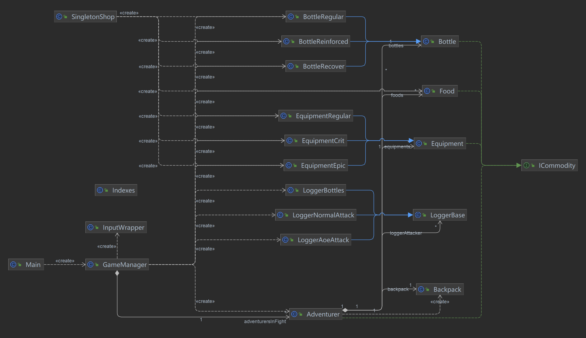

# 前情提要

在这片土地上，你是一场冒险游戏的掌控者，你需要管理着**一群冒险者**，还有他们的**药瓶**、**装备**与**食物**，他们有各自的**物品仓库**，也会有随身携带的**背包**，他们之间会有**战斗**，也会有相互的**帮助**。同时，你还是一个**商店**的经营者，收购并出售各式物品。

<!--more-->

> 博客链接：https://swkfk.top/jump/oopre-hw8
> 代码仓库：https://github.com/swkfk/BUAA-2023-OOPre-Code （可以查阅全部提交信息）

# 一、结构设计

经过 5 次的开发与迭代后，代码已经初具规模，并具备了一定的结构。

## 接口与类的分类与调用关系

按照功能分类与调用层次，可对类作如下划分：

<table style="text-align: center">
<thead>
    <tr>
        <th></th>
        <th>类</th>
        <th>功能描述</th>
    </tr>
</thead>
<tbody>
    <tr>
        <td rowspan="4" style="writing-mode:tb-rl">输入处理</td>
        <td><code>Main</code></td>
        <td>读取操作与日志，向下层分发指令</td>
    </tr>
    <tr>
        <td><code>GameManager</code></td>
        <td>游戏的管理核心，向游戏中的具体角色下发指令</td>
    </tr>
    <tr>
        <td><code>InputWrapper</code></td>
        <td>对 <code>ArrayList&lt;String&gt;</code> 进行的封装，简化对数字的解析</td>
    </tr>
    <tr>
        <td><code>Indexes</code></td>
        <td>实用类，将输入列表的下标整合起来</td>
    </tr>
    <tr>
        <td rowspan="2" style="writing-mode:tb-rl">冒险者</td>
        <td><code>Adventurer</code></td>
        <td>管理单个冒险者的属性与动作，可操作背包</td>
    </tr>
    <tr>
        <td><code>Backpack</code></td>
        <td>维护冒险者背包中的物品，处理冒险者对于背包的交互</td>
    </tr>
    <tr>
        <td rowspan="4" style="writing-mode:tb-rl">药水瓶</td>
        <td><code>Bottle</code></td>
        <td>药水瓶的基类，被调用者使用</td>
    </tr>
    <tr>
        <td><code>BottleRegular</code></td>
        <td>普通药水瓶，继承自 <code>Bottle</code></td>
    </tr>
    <tr>
        <td><code>BottleReinforced</code></td>
        <td>强化药水瓶，继承自 <code>Bottle</code></td>
    </tr>
    <tr>
        <td><code>BottleRecover</code></td>
        <td>百分比恢复药水瓶，继承自 <code>Bottle</code></td>
    </tr>
    <tr>
        <td rowspan="4" style="writing-mode:tb-rl">装备</td>
        <td><code>Equipment</code></td>
        <td>装备的基类，被调用者使用</td>
    </tr>
    <tr>
        <td><code>EquipmentRegular</code></td>
        <td>普通装备，继承自 <code>Equipment</code></td>
    </tr>
    <tr>
        <td><code>EquipmentEpic</code></td>
        <td>百分比伤害装备，继承自 <code>Equipment</code></td>
    </tr>
    <tr>
        <td><code>EquipmentCrit</code></td>
        <td>暴击装备，继承自 <code>Equipment</code></td>
    </tr>
    <tr>
        <td rowspan="1" style="writing-mode:tb-rl">食物</td>
        <td><code>Food</code></td>
        <td>食物类</td>
    </tr>
    <tr>
        <td rowspan="1" style="writing-mode:tb-rl">商店</td>
        <td><code>SingletonShop</code></td>
        <td>单例商店类，负责收购并记录物品，以及<b>创造</b>、出售物品</td>
    </tr>
    <tr>
        <td rowspan="4" style="writing-mode:tb-rl">日志记录</td>
        <td><code>LoggerBase</code></td>
        <td>日志抽象类，提供存储与字符串转化的约束</td>
    </tr>
    <tr>
        <td><code>LoggerBottles</code></td>
        <td>冒险者喝药的日志类</td>
    </tr>
    <tr>
        <td><code>LoggerNormalAttack</code></td>
        <td>冒险者进行普通攻击的日志类</td>
    </tr>
    <tr>
        <td><code>LoggerAoeAttack</code></td>
        <td>冒险者进行 AOE 攻击的日志类</td>
    </tr>
</tbody>
</table>

其中，冒险者、药水瓶、装备与食物共同实现了 `ICommodity` 接口，提供了获取价值、获取属性、获取归属类名的方法。

商店类中，实现了 `TradeLog` 内部类，对通过上述接口对三类商品的收购记录进行管理。

## UML 类图

# 二、迭代与重构过程

## 五次作业，四次迭代

第二次作业是对游戏中角色的**基础实现**，笔者同时设计了 `GameManager` 类进行全局的管理，以简化主类的功能。

第三次作业添加了背包的概念，背包属于冒险者，理应由冒险者管理，需要达到背包对 `GameManager` 隐藏的效果。同时，这一次作业也是对**数据结构**选择的考察，背包中采用怎样的形式来组织物品是一个很重要的话题。

第四次作业添加了对战斗日志的支持，除了考察**正则表达式**，也是对**输入处理**的一次不小的考验，同时，战斗日志层级较高，笔者考虑直接由 `GameManager` 进行管理。

第六次作业添加了价值体的概念，并设计接口进行统一的管理，同时，为物品添加了不同的种类，考察类的继承。无论是三种药水瓶还是三种装备，它们分别有一个共同的基类，笔者在进行开发时，利用这**两个基类与接口**，简化了代码的复杂度。

第七次作业是对**单例模式**与**观察者模式**的考察，以及被笔者忽视的**工厂模式**。涉及计算的细节较多，很考察前期设计的结构。

## 一次代码重构

在第四次作业通过后，处理输入部分的代码已经极为臃肿，并且为了迎合风格检查，对不同的操作做了很多混乱的拆分。在第四次作业后，我对这一部分的代码进行了重构，采用表驱动的方式，为每个操作新设方法，对后续的迭代产生了较好的帮助。

## 还差两次代码重构

观察上面的 UML 类图，可以发现，药水瓶、装备、食物的创建集中在两个类中：`SingletonShop` 与 `GameManager`，并且在实现时，有大量重复的代码（比如对类别的判断），因此，这里需要的重构是使用工厂模式，用于“生产”这些物品。

同时，考虑到药水瓶、装备、食物中有大量方法的重合，应该考虑抽象出一个共同的接口，已简化其中冗余的代码。

# 三、`JUnit` 使用心得

`JUnit` 的合理使用可以帮助检查代码中潜在的漏洞，分支覆盖率的要求可以强制程序员再次思考代码的逻辑与含义。

在这一次的迭代作业中，笔者编写了一系列的单元测试，对单类的功能进行了较为详尽的测试，同时也包含了一些综合测试，主要针对 `GameManager` 类。

在实际开发中，我遇到了一定的困惑，首先，综合测试应该不属于单元测试的范畴，是我为了覆盖率和偷懒采取的一种简便策略。此外，对某些类进行测试时，为了获取运行状态，需要在类中额外添加 `getter` 方法，这是我不太愿意做的一件事情，也许会有更好的处理方式。

# 四、课程学习心得与建议

## 先导课程学习心得

这是我第一次很正经地使用面向对象程序设计的方法，并且从简到繁一步步迭代开发，感受到了面向对象设计思路的优点与魅力。在开发时，我可以将精力专注于当前正在做的事情，但这也给**整体**的谋篇布局带来了不小的考验。

希望在今后的学习中，我能够逐步参悟面向对象思想的精髓，并不断进步！

## 对课程的建议

- 进一步明确并教授单元测试的方法，根据项目实际调整测评标准。
- 指导书可以将教程与题目描述分成两个板块，而不是在一篇文章中前后放置，这样可能会方便阅读与查找。
